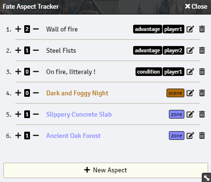

# Fate Aspect Tracker

**Fate Aspect Tracker** is a simple module for [Foundry Virtual Tabetop](https://foundryvtt.com/) that allows the GM to keep track of the *aspect* and their *free invoke* in any kind of [Fate](https://www.evilhat.com/home/fate-core/) game. Only the GM can create, edit and delete aspects but every player can open **Fate Aspect Tracker** and see every aspect and their number of free invoke.

The module can be opened with the **book button** in the **scene menu**, **token tab**.

Aspects can be dragged and dropped onto the scene to create a text box with the aspect description and the number of free invoke in it. Updating the aspect through the tracker will result in the text box to be changed as well. The text box uses the **default drawing settings** except for the box size and font size that are based on the canvas size.

**Warning.** The data is recorded on a journal entrey named *"_aspect_tracker"* which is created by the module if it does not exist. If you delete this journal entry, you have to **reload** the game so that the module creates a new empty journal.

**Download.** https://raw.githubusercontent.com/Galdormin/FoundryVTT-Fate-Aspect-Tracker/master/module.json

## Screenshot

## Macros

See [Macro](macro)

## Patch Notes

See [CHANGELOG.md](CHANGELOG.md)

## License

This work is licensed under the [MIT license](LICENSE), as well as [Foundry Virtual Tabletop EULA - Limited License Agreement for Module Development](https://foundryvtt.com/article/license/).

This work is based on [Keikaku - To-Do List Manager](https://github.com/pyrige/fvtt-keikaku) licensed under [MIT License](https://github.com/pyrige/fvtt-keikaku/blob/main/LICENSE).