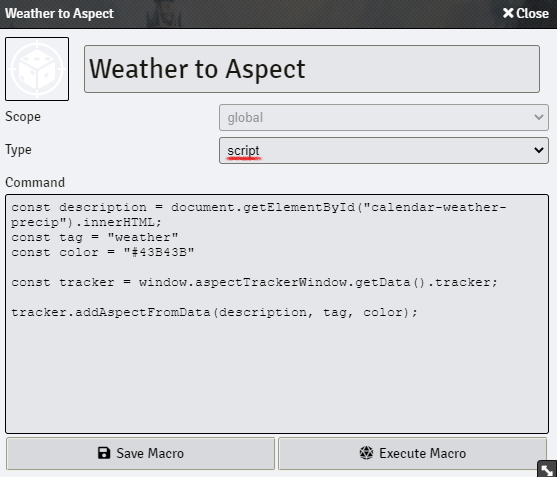

# Fate Aspect Tracker Macro

To use the macros, simply copy the contents of the `.js` file into a new macro and select `script` in the macro type.

## Weather to Aspect

This macro adds a new weather aspect to the tracker based on the weather provided by the [Calendar/Weather module](https://foundryvtt.com/packages/calendar-weather).

File : `weather-to-aspect.js`